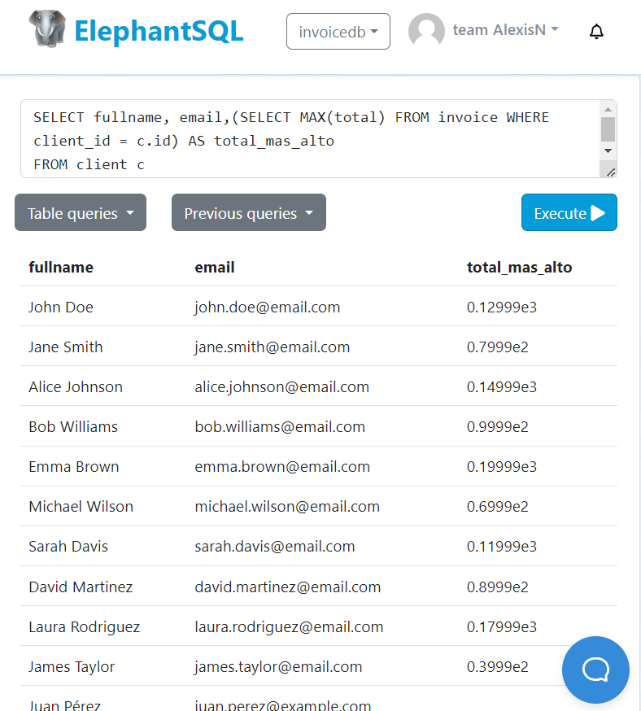

# TAS12- Subconsultas
---
### 1. El numero total de facturas realizadas por cada cliente: nombre_cliente | dirección | nro_facturas
---
- Sentencia:
```
SELECT c.fullname, c.address, (SELECT COUNT (*) FROM invoice WHERE client_id = c.id) AS total_invoices
FROM client c
```

- Captura


### 2. Listar nombre y correo de los clientes junto a su compra mas cara realizada: nombres |  correo   | total_mas_alto
---
- Sentencia:
```
SELECT fullname, email,(SELECT MAX(total) FROM invoice WHERE client_id = c.id) AS total_mas_alto
FROM client c
```

- Captura



### 3. Listar las facturas donde sus totales sean mayores al promedio de las facturas: fecha_factura | total
---
- Sentencia:
```
SELECT create_at, total
FROM invoice
WHERE total > (SELECT AVG (total) AS total_promedio FROM invoice)
```

- Captura


### 4. Listar el total de asistentes en cada conferencia: title | day | total_attendees
---
- Sentencia:
```
SELECT c.title, c.day, (SELECT COUNT(r.member_id) 
FROM register r 
 WHERE r.conference_id = c.id) AS total_attendees
FROM 
 conference c;
```

- Captura


### 5. Listar nombres y correos de los miembros que han asistido a la conferencia: fullname | email | id 
---
- Sentencia:
```
SELECT m.fullname, m.email FROM member m
WHERE m.id IN (SELECT r.member_id FROM register r
WHERE r.conference_id = 4);
```

- Captura


